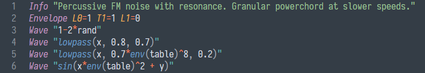
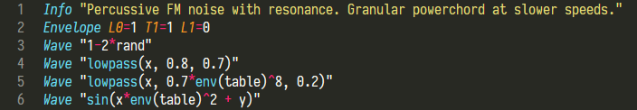
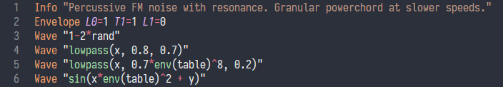

# UHM Syntax Highlight
Preliminary version of ST3 syntax highlighter for preliminary version of [Hive][1]'s wavetable [scripting language][2].

[1]: https://u-he.com/products/hive/
[2]: https://www.kvraudio.com/forum/viewtopic.php?f=31&t=511390

Work in progress. Use at you own risk.

  
## Install

1. Package Control:
    - `Contrl+Shift+P` > `Package Control: Install Package` > `UHM Syntax` 

2. Manual:
    - download zip archive 
    - extract zip archive to Sublime's `\Packages\` folder. (To find your `\Packages\` folder, run `Preferences` > `Browse Packages...` from Sublime's menu)

## Screenshots

Mariana  

Monokai  

Base16 Pastel Paws  
